# Project Architecture Diagram

Below is the complete Graphviz DOT language code representing the macro-architecture of the AI-Powered Job Recommendation platform. 

You can render this diagram by pasting the code below into visualizers natively supporting Graphviz, such as [GraphvizOnline](https://dreampuf.github.io/GraphvizOnline/), [WebGraphviz](http://www.webgraphviz.com/), or natively in environments mapping to standard `.dot` visualizations.

```dot
digraph Architecture {
    // Global Graph styling properties
    fontname="Helvetica,Arial,sans-serif";
    node [fontname="Helvetica,Arial,sans-serif", shape=box, style="rounded,filled"];
    edge [fontname="Helvetica,Arial,sans-serif", fontsize=10, fontcolor="#4b5563"];
    rankdir=LR; // Left to Right structural diagram
    splines=spline;
    compound=true;

    // ----------------------------------------------------
    // Subgraph 1: Client Application (Frontend)
    // ----------------------------------------------------
    subgraph cluster_frontend {
        label = "Frontend Application (React 18 + Vite)";
        style = "filled,rounded";
        color = "#f3f4f6";
        fontcolor = "#1f2937";
        node [fillcolor="#93c5fd", color="#2563eb", fontcolor="#000000"];
        
        UI [label="User Interface\n(Tailwind CSS components)"];
        Router [label="Client Routing\n(React Router DOM)"];
        State [label="Global State\n(React Context APIs)"];
        Axios [label="HTTP Client\n(Axios + Auth Interceptors)"];

        UI -> Router -> State -> Axios [color="#9ca3af"];
    }

    // ----------------------------------------------------
    // Subgraph 2: Central API (FastAPI Backend)
    // ----------------------------------------------------
    subgraph cluster_backend {
        label = "Backend Ecosystem (FastAPI / Uvicorn)";
        style = "filled,rounded";
        color = "#f3f4f6";
        fontcolor = "#1f2937";
        node [fillcolor="#a7f3d0", color="#059669", fontcolor="#000000"];

        API [label="FastAPI REST Interface\n(Port 8000)", shape=hexagon, fillcolor="#10b981", fontcolor="white"];
        
        Auth [label="Authentication Service\n(JWT & Bcrypt)"];
        ResumeMatcher [label="AI Matching Engine\n(Cosine Similarity / TF-IDF)"];
        ResumeParser [label="NLP Execution Environment\n(spaCy NER + PyMuPDF)"];
        Guidance [label="Guidance Service\n(Gap Analysis)"];
        Scraping [label="Ingestion Controller\n(Web Scraping & Normalization)"];
        Scheduler [label="APScheduler Engine\n(In-process Async Cron)"];
        Config [label="Configuration Singleton\n(Immutable Dataclass)"];

        API -> Auth [label=" Middleware (JWT Auth Check)"];
        API -> ResumeMatcher;
        API -> Guidance;
        API -> Scraping;
        API -> ResumeParser [label=" BackgroundTasks\n(Instant HTTP Yield)"];
        
        Scheduler -> Scraping [label=" Triggers every 6 hours", color="#6366f1", style="dashed"];
        Config -> API [label=" Injects Env Vars", style="dotted"];
    }

    // ----------------------------------------------------
    // Subgraph 3: Persistence Layer (NoSQL)
    // ----------------------------------------------------
    subgraph cluster_database {
        label = "Database Layer (MongoDB Atlas)";
        style = "filled,rounded";
        color = "#fef3c7";
        fontcolor = "#b45309";
        node [fillcolor="#fcd34d", color="#d97706", fontcolor="#000000"];
        
        Mongo [label="MongoDB Driver\n(MotorAsyncIO)", shape=cylinder, fillcolor="#f59e0b", fontcolor="white"];
        UsersCol [label="Users Collection\n(Unique Emails)"];
        JobsCol [label="Jobs Collection\n(Unique Compound Identifiers)"];
        ProfilesCol [label="Resume Profiles Collection\n(Stored Semantic Vectors)"];
        
        Mongo -> UsersCol;
        Mongo -> JobsCol;
        Mongo -> ProfilesCol;
    }

    // ----------------------------------------------------
    // Subgraph 4: External Third-Party APIs
    // ----------------------------------------------------
    subgraph cluster_external {
        label = "External Networks & Providers";
        style = "dashed";
        color = "#9ca3af";
        node [fillcolor="#818cf8", color="#4f46e5", fontcolor="white"];

        Gemini [label="Google Gemini API\n(Generative Remediation Models)"];
        USAJobs [label="USAJOBS REST API\n(Structured Federal Data)"];
        RSS [label="Remote Work RSS Feeds\n(Unstructured Open-Web XML)"];
        SerpAPI [label="SerpAPI Google Proxies\n(Dynamic Job Inference HTML)"];
    }

    // ----------------------------------------------------
    // Cross-Domain Interconnections
    // ----------------------------------------------------

    // Network Connectivity
    Axios -> API [label=" Asynchronous HTTPS / JSON payloads", color="#3b82f6", penwidth=2];
    
    // Database Connectivity
    Auth -> Mongo [label=" Async Verification\nReads/Writes", color="#d97706"];
    ResumeMatcher -> Mongo [label=" Text Aggregations\n& Caching", color="#d97706"];
    ResumeParser -> Mongo [label=" Stores Abstracted Profile", color="#d97706"];
    Scraping -> Mongo [label=" Inserts (C++ Native Deduplication)", color="#d97706"];

    // External API Consumption Connectivity
    Scraping -> USAJobs [label=" httpx Async Fetch", color="#4f46e5", style="dashed"];
    Scraping -> RSS [label=" XML Streaming/Parsing", color="#4f46e5", style="dashed"];
    Scraping -> SerpAPI [label=" HTTP API Proxy", color="#4f46e5", style="dashed"];
    Guidance -> Gemini [label=" Prompt Delta Context\n(via Google GenAI SDK)", color="#4f46e5", style="dashed", penwidth=1.5];
}
```

